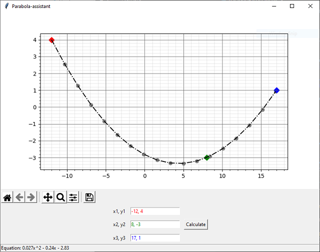

# Parabola-assistant

GUI-driven app to solve and draw a quadratic parabola based on three known points. Utilizes the numpy linear matrix equation / system of linear scalar equations solver.

tkinter, matplotlib, numpy required

    <i>screenshot</i> 
    

Original idea based on the parabola calculator scripts by mr. Chris Williams http://chris35wills.github.io/parabola_python/
